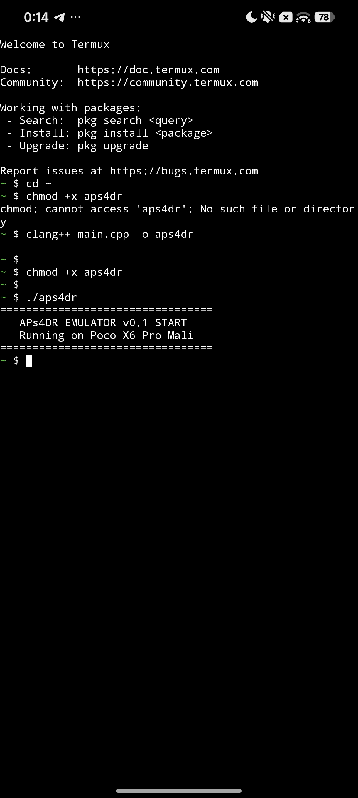

# APs4DR
Experimental PlayStation 4 emulator for Android (ARM64 architecture) based on the **shadPS4** source code.

## 🚀 Project Goal
The main objective of **APs4DR** is to port the core logic of shadPS4 to Android devices, implement a powerful JIT compiler (x86_64 to ARM64 translation), and optimize the Vulkan rendering backend specifically for mobile GPUs, including **Mali GPU fixes**.

## 🛠 Current Status
- **Stage:** Early Development / Research
- Basic environment configured via Termux on POCO X6 Pro (Dimensity 8300 Ultra).
- Looking for C++ developers, JIT compiler experts, and Vulkan API engineers!

## 📢 Join Our Community
All live discussions, logs, and development updates are happening in our official Telegram channel:
👉 **[JOIN CHISTRASTUDIO TELEGRAM CHANNEL](https://t.me/APs4DR_In_CHistraStudio) 

